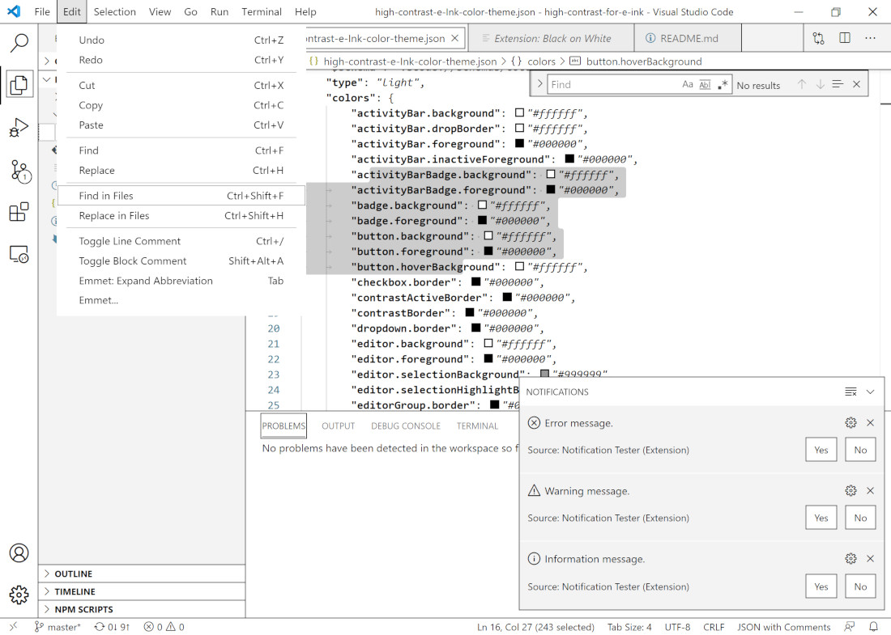

# Light High Contrast Theme of Visual Studio Code for E Ink Monitors 

Features:
* White background separated by black borders
* No highlight but also borders for item selection

## Acknowledgements

This theme was inspired by:
* UI of [ONYX BOOX series](https://onyxboox.com/)
* [High contrast theme of Visual Studio Code](https://code.visualstudio.com/docs/editor/accessibility#_high-contrast-theme)

Syntax color is from [E-Ink](https://marketplace.visualstudio.com/items?itemName=mufanza.e-ink-theme), which is also a theme for E Ink monitors.

[Notification Tester](https://marketplace.visualstudio.com/items?itemName=svipas.notification-tester) extension was used to test.
